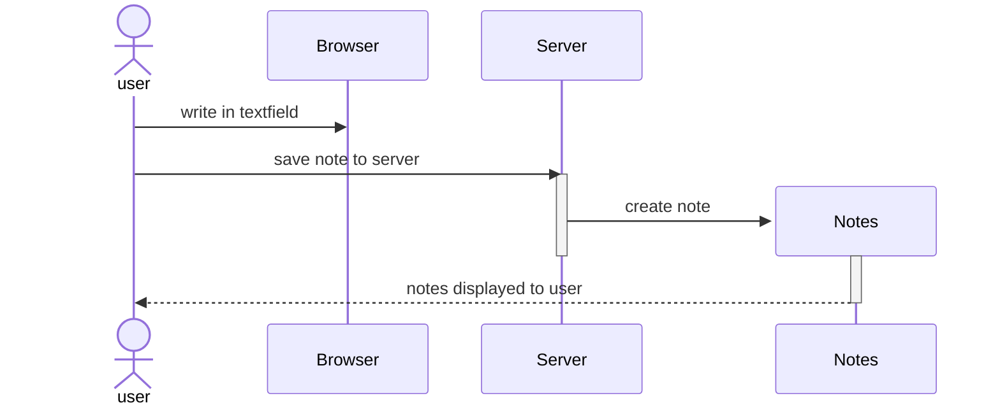

# 0.4: New note diagram

Created a sequence diagram depicting the situation where a user creates a new note on the page https://studies.cs.helsinki.fi/exampleapp/notes by writing something into the text field and clicking the Save button.

# Sequence Diagram

