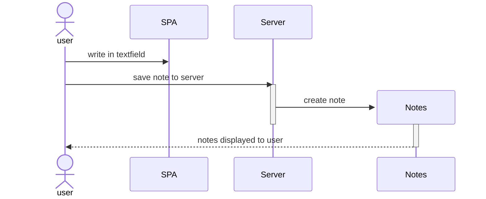

# 0.4: Single Page App diagram

Created a sequence diagram depicting the situation where a user user goes to the single-page app version of the notes app https://studies.cs.helsinki.fi/exampleapp/notes by writing something into the text field and clicking the Save button.

# Sequence Diagram

